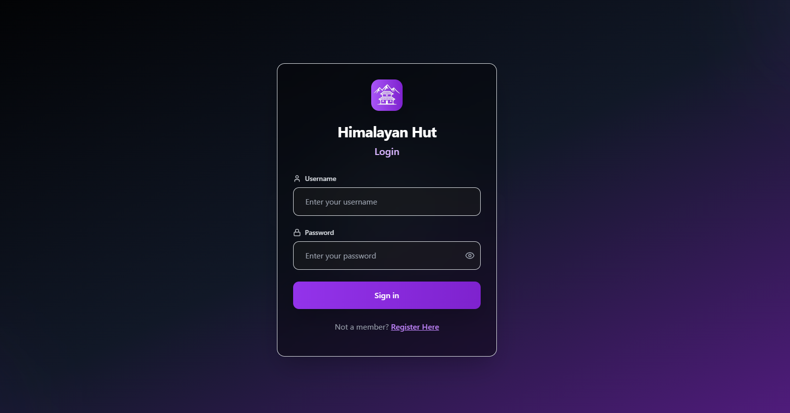

# Himalayan Hut 🎬🏔️

A **full-stack movie watchlist and recommendation web application** built with **FastAPI, React, PostgreSQL, MinIO, and Scikit-learn**, designed to deliver personalized movie recommendations with both **content-based** and **collaborative filtering** approaches.  

Please visit **www.himalayanhut.xyz**

---

## 🚀 Features

- 🎯 **Recommendation Engine**
  - Content-based filtering using cosine similarity (`user-to-movie`, `movie-to-movie`, `watchlist-to-movie`)  
  - Per-user result caching for optimized response times  
  - Collaborative filtering with label encoding, CSR matrix construction, and **Alternating Least Squares (ALS)** for interaction-based recommendations  

- 📺 **Watchlist App**
  - User authentication with email-based **2FA**  
  - Create, track, rate, and share movie watchlists  
  - Interactive UI built with **React + Tailwind CSS**  

- 🗄️ **Media & Data Management**
  - PostgreSQL for relational data  
  - MinIO for media file storage  

- ⚡ **Deployment**
  - Self-hosted on **Ubuntu VM**  
  - Containerized with **Docker Compose**  
  - **NGINX** as reverse proxy, load balancer, and DNS manager  

---

## 🛠️ Tech Stack

**Frontend:** React, Tailwind CSS  
**Backend:** FastAPI (Python)  
**Database:** PostgreSQL  
**Storage:** MinIO  
**ML/Recommendation Engine:** Scikit-learn, ALS (implicit feedback)  
**Deployment:** Docker Compose, NGINX, Ubuntu VM  

---
##🧪 Recommendation Engine

- Content-based filtering
- Cosine similarity (user-to-movie, movie-to-movie, watchlist-to-movie)
- Cached per-user recommendations for speed
- Collaborative filtering
- Label encoding → CSR matrix → ALS (Alternating Least Squares)
- Recommendations driven by user-item interactions

##🔒 Security

- Email-based 2FA authentication
- Secure reverse proxy via NGINX
- Environment variables for secrets (.env, not committed to GitHub)

## 📸 Demo & Screenshots

### Login Page

### Main Page

### Watchlist Page

### User Page

